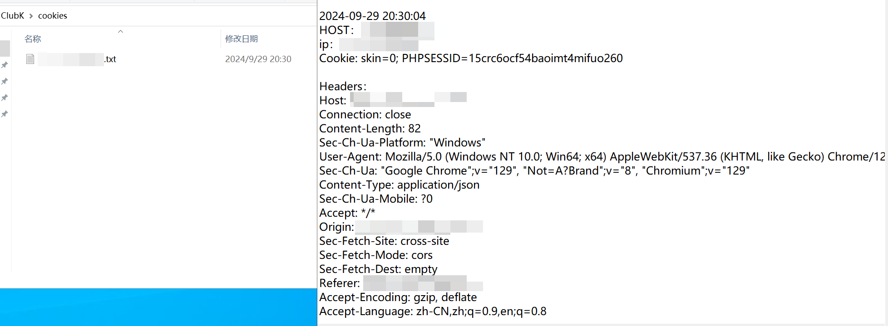
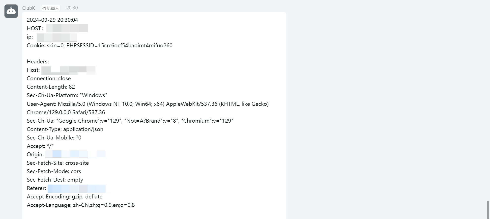
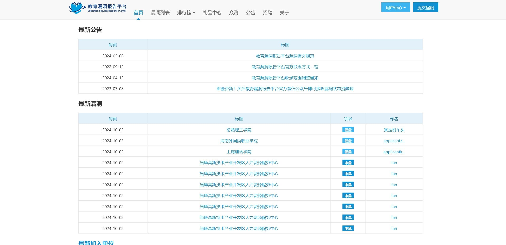
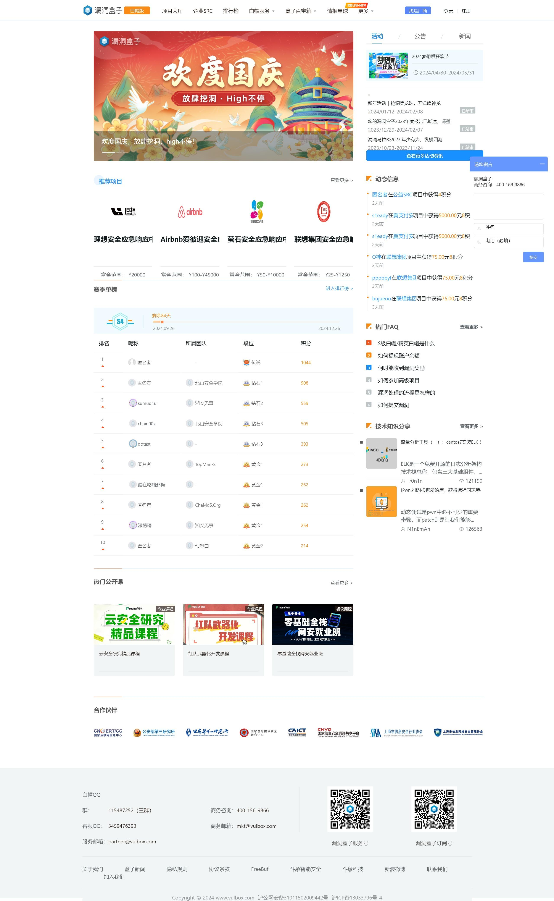

# ClubK

## 免责声明

**本工具仅供学习、学术研究、合法渗透测试和网络安全教育使用，在任何情况下，不得用于任何非法目的，造成的任何问题皆与本库开发者无关。**

## Intro

```markdown
 _____   _           ___   _____   _   _   
/  ___| | |         /   | |  _  \ | | / /  
| |     | |        / /| | | |_| | | |/ /   
| |     | |       / / | | |  _  { | |\ \   
| |___  | |___   / /  | | | |_| | | | \ \  
\_____| |_____| /_/   |_| |_____/ |_|  \_\ 
```

ClubK是基于python3编写的简易xss测试平台，本工具将持续维护。

设计该工具的初衷是因为目前的开源xss平台中web端居多，由于平时维护可能不太方便，所以我本人是希望有一个较为轻量化的xss平台，开箱即用，于是便有了ClubK。

### 功能：

1. 支持https
2. 接受cookie
3. 支持页面截图
4. 可配置钉钉机器人
5. 可加载自定义JS

## 配置

1. clone到本地后使用`pip install -r requirements.txt`安装所需的库。

2. 在config更改HOST，也就是接受地址，**必须加上协议头**。

3. 默认端口为5000，可根据需要自行更改。

4. 如有配置ssl需求，需在根目录创建ssl文件夹，然后将ssl证书下载至此，接着在config填充crt和key文件地址，例如：`r'ssl/xxx.online_bundle.crt'`、`r'ssl/xxx.online.key'`。

5. 如有配置钉钉机器人需求，请先查阅钉钉官方文档查看如何创建机器人：`https://open.dingtalk.com/document/orgapp/custom-robot-access`，需要注意的是创建机器人时安全设置需要设置为**加签**模式，然后将机器人的Webhook和secret填充到config即可。

6. 启用页面截图之前，可根据需求在config更改waiting_time。页面如果正常加载完毕是会直接进行截图的，而这个变量主要是为了防止页面一直没加载完毕从而导致脚本不去进行截图，这可能是由于页面的一些资源卡住等问题造成的，所以此时可以通过设置waiting_time等待时间，也就是等待页面加载的差不多的时候就进行截图。

### 自定义JS配置

如果有配置自制的JS需求，需将该JS放入**static**目录下即可，然后运行ClubK时指定-js即可。

## 使用

直接运行ClubK即可，默认会在static目录下生成**request.js**，即为攻击脚本。接受到的cookie会下载到cookies目录下，文件名即为目标地址。

>配置ssl后启用https

```shell
python ClubK.py -ssl
```

>启用钉钉机器人

```shell
python ClubK.py -d 或 python ClubK.py --ding
```

>启用页面截图

```shell
python ClubK.py --screen
```

>自定义JS

```shell
python ClubK.py -js
```

>启用接受到数据后立即关闭服务端

```shell
python ClubK.py --clear
```

## 效果




### 页面截图效果

以下采用的是油猴注入方式进行的页面截图效果采样：

edusrc：


freebuf:


漏洞盒子:


## Tips

1. 如果启用了钉钉机器人，需要注意的是**每个机器人每分钟最多发送20条消息到群里**，超过20条不会继续发送。

2. 如果配置了自制的JS，需要注意的是本工具只支持**post**请求。

3. 如果启用了页面截图，一般情况下来说截下来的图都应该是加载完毕了的，如果有截图是未加载完毕的，可能有以下几种原因：

>1. 等待时间太短导致页面没加载完毕就进行截图。
>2. 资源异步加载。
>3. 资源懒加载。

4. 截图若返回非正常内容，可能是由于该请求并未渲染在页面上而导致的截图失败。

5. 若启用了钉钉机器人，消息大小尽量不要超过20000bytes，否则会发送失败。

6. 增加接受到数据后立即关闭服务端功能主要是为了防止脚本一直生效，其初衷是担心有些朋友可能会插入钓鱼脚本，脚本一直生效的话可能会让受害者做出一些措施导致权限很快失效。

## Contact

如有bug或其他问题可提交issues，或者关注公众号Spade sec联系我。